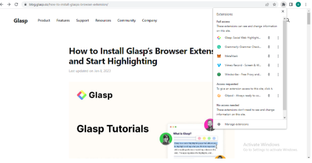
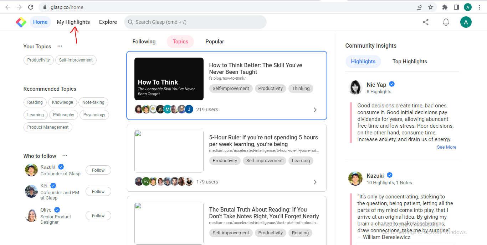

# A Beginner’s Guide to Glasp: Highlight and Create Notes on the Web  

  

<!-- vscode-markdown-toc -->
* 1. [Introduction](#Introduction)
* 2. [What is Glasp?](#WhatisGlasp)
* 3. [Features of Glasp](#FeaturesofGlasp)
* 4. [Benefits of Using Glasp Web Highlighter](#BenefitsofUsingGlaspWebHighlighter)
* 5. [How to Use the Glasp Web Highlighter](#HowtoUsetheGlaspWebHighlighter)
* 6. [Frequently Asked Questions](#FrequentlyAskedQuestions)
* 7. [Conclusion](#Conclusion)

<!-- vscode-markdown-toc-config
	numbering=true
	autoSave=true
	/vscode-markdown-toc-config -->
<!-- /vscode-markdown-toc -->

##  1. Introduction  
If you love highlighting while you browse, then you’ll appreciate this web tool, Glasp. 
Whether it's for school, work, or personal purposes, we depend heavily on the web for gathering information and gaining knowledge. However, with so much information available online, it can be challenging to keep track of all the valuable insights we come across. This is where Glasp comes in.  

##  2. What is Glasp?  
  
[Glasp](https://glasp.co/) is a social web highlighter designed to help you highlight and organize quotes and thoughts. It’s a powerful web app that can improve your web reading experience. With Glasp, you can highlight important text on web pages using different colored highlighting options and categorize your findings. 
You can also create notes and share them with others on a variety of platforms. Glasp is the perfect tool for writers, researchers, students, and anyone who wants to keep track of essential information while reading on the web. 
Interestingly, Glasp isn’t just for highlighting texts and taking notes. It’s also a social tool. So you can follow interesting people and see what they are reading, highlighting, and noting.  

##  3. Features of Glasp  
Glasp is a great web highlighting tool with various features to enhance your web reading experience and make it easier to organize essential information. Some of the features include the following:  

1. Highlighting: With Glasp, you can highlight important sections of any webpage. Simply select the text you want to highlight and choose a color. This highlighting feature makes it easier to access information and important details later. 

2. Create Notes: Creating notes is another powerful feature of the Glasp app. You can add notes to your highlighted sections. That way, it’s easy to provide additional context and information to your findings. 

3. Categorization: Asides from highlighting texts and making notes, you can also categorize your findings. With Glasp, you can categorize your highlights into different topics. Doing this makes it easy to organize your research.  

4. Sharing and Collaboration: As mentioned earlier, Glasp is a social web tool. So you can share your notes and highlights with people. That way, you can collaborate with others on research topics, share ideas with colleagues, and also get feedback.  

5. Export in Different Formats: Glasp allows you to export your highlights in different formats. You can export highlighted sections in HTML, CSV, and text.  

##  4. Benefits of Using Glasp Web Highlighter
There are several key benefits of using the Glasp Web Highlighting tool for online research. Some of the notable benefits include:  
1. Time-Saving and Convenient: With Glasp, you don’t have to continue switching between web pages when browsing or reading an article. It allows you to effortlessly clip important sections of web pages and videos. Also, the next time you visit the web page, you’ll see the highlighted texts and notes. 

2. Organization: You can organize your highlights into different categories and sub-categories with Glasp. It’s easy for users to access information quickly when they need them.  

3. Collaboration: Users can share their notes and highlights with others, making it easy to collaborate with colleagues and friends on other platforms like Twitter. 

4. Customization: You can tailor the Glasp app to your preferences. For instance, when highlighting a section of a web page, you can choose the color of your highlight.

##  5. How to Use the Glasp Web Highlighter
It’s easy to get started with this web highlighting tool. Here’s a guide on how to start highlighting with Glasp. 
1. Create an account: Visit the Glasp [website](glasp.co) and create a free account.

  

After clicking the Sign-up button, another page appears. Proceed to create an account using your Google account.  

  

2. Install the Glasp Extension to Your Browser: Install the Glasp extension for your web browser. You can install it for Chrome, Brave, Safari, Microsoft Edge, and so on. The extension enables you to highlight web pages directly in your browser. You can also decide to pin it on the toolbar for easy access.  

  

Click **Add to Chrome** to install the extension.  

 

When you click on the Extensions icon, you should see Glasp installed.  

3. Highlight an Article: When you come across an important or catchy section of an article, select the text. When you select it, a popup will appear. Choose any color you like. If you want to remove the highlight, click on the close icon that appears when you click on the highlighted section.  

  

4. View your Highlights: All your highlights will be saved to your Glasp account. Open the Glasp home page and go to **My Highlights** at the top left. 

  

The home icon is at the top right of the sidebar  

  

When you click on **My Highlights**, it shows all your highlights. Click on the one you want to categorize. You’ll see a tag section, click on ‘Empty’ to add a category. 

  

5. Share your Highlights and Notes: You can copy your Glasp profile link and share it with others. Anyone with the link can view your highlights and notes.  

6. Deleting your Highlights: Users can also delete highlighted articles. Select the highlight, then click on the three dots at the top right. You’ll see **Delete Page**.  

  

##  6. Frequently Asked Questions  
1. Is Glasp Web Highlighter free to use?  
Yes, Glasp Web Highlighter is completely free to use.

2. Can I use Glasp on mobile devices?  
No, Glasp Web Highlighter is currently available only as a desktop browser extension 

3. Can I export my highlights and notes from Glasp?  
Yes, you can export your highlights and notes as a PDF or CSV file.

4. Is there a private mode feature?  
No, as of the time of writing, there is no private mode function. 

5. Can I highlight YouTube Videos?  
Yes, you can highlight the transcript on YouTube videos. Glasp has a detailed [tutorial](https://blog.glasp.co/how-to-highlight-youtube-transcript/) on how to do that.  

##  7. Conclusion
Glasp is a useful tool for anyone who wants to enhance their web reading experience. It's a great way to highlight important text, create notes, and organize them in different categories. This tool has an easy-to-use interface and customizable options to personalize your note-taking experience.  

You can also share your highlighted articles with others, making it a perfect web app for collaboration. Whether you are a writer, teacher, community learner, or professional, this web highlighting tool will help you keep track of important information online. 

